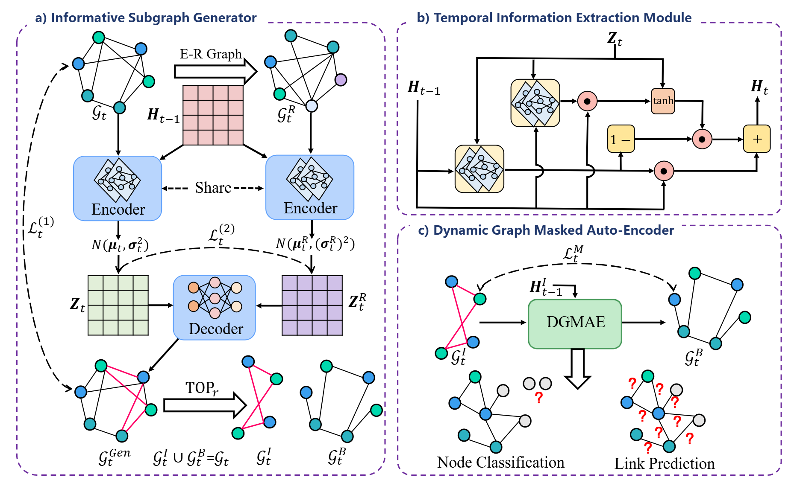

<h1 align="center">
Informative Subgraphs Aware Masked Auto-Encoder in Dynamic Graphs
</h1>


<p align="center">
  
<p align="center"><em>Fig. 1. The overall framework of the DyGIS.</em>
</p>

 >**This is the PyTroch implementation for International Conference on Data Mining (ICDM) 2024 Regular paper: 
Informative Subgraphs Aware Masked Auto-Encoder in Dynamic Graphs**

DyGIS is a self-supervised with masking dynamic graph representation learning method. It introduces additional constraints to ensure 
the generated informative subgraphs guide the evolution of the dynamic graph, eliminating the effect of missing crucial information 
due to applying a random masking strategy to the dynamic graph. The overall framework is shown in Fig. 1.

# Dependencies
* cuda = 11.3
* python >= 3.9
* pytorch >= 1.12.0
* numpy >= 1.24.3
* pyg >= 2.3.0
* scikit-learn >= 1.2.2
* scipy >= 1.16.0
<<<<<<< HEAD
* tqdm >=4.65.0
=======
# How to run
## link detection
* python main.py --dataset 'data name'
>>>>>>> d3ff1887209643b876577adff319545256c43e84


# Training & Evaluation
## link detection task
```
python main.py --dataset 'dataset'
```

## link prediction and new link prediction
<<<<<<< HEAD
```
python prediction.py --dataset 'dataset'
```

## node classification
```
python train_node_class.py --dataset 'dataset'
```
=======
* python prediction.py --dataset 'data name'

## node classification
* python train_node_class.py --dataset 'data name'
>>>>>>> d3ff1887209643b876577adff319545256c43e84
